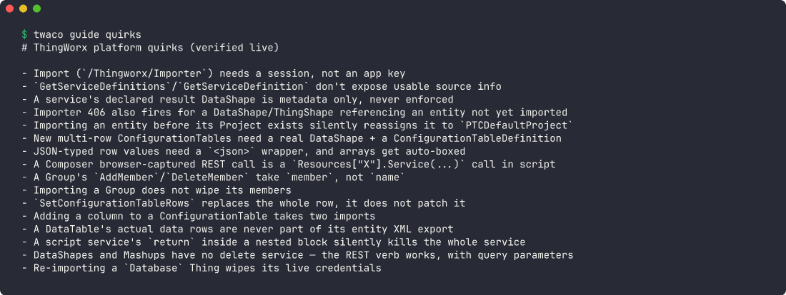
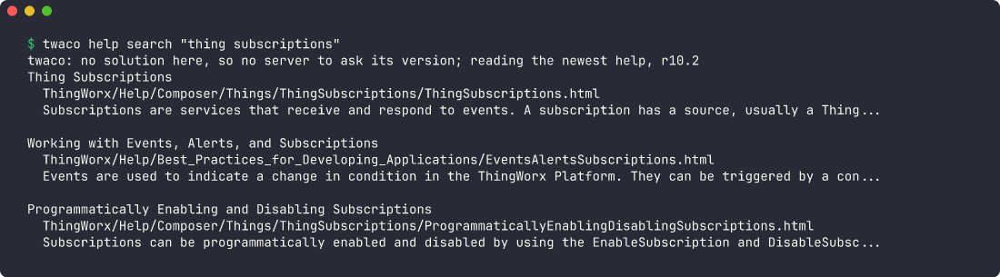
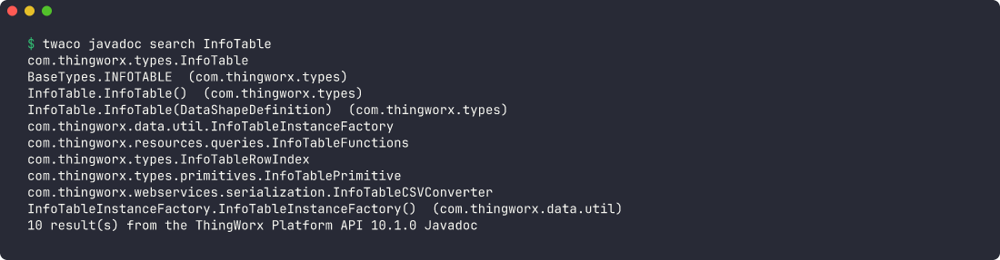

<div align="center">


# twaco

**Keep a ThingWorx solution in source control, and work on it from a terminal or an AI agent.**
**Service scripts as files, safe deploys, and the platform's knowledge one command away.**

[](https://github.com/butteredstardust/twaco/releases/latest)
[](https://github.com/butteredstardust/twaco/actions/workflows/ci.yml)
[](LICENSE)
[](https://github.com/butteredstardust/twaco/releases/latest)

<br>



</div>

---

ThingWorx keeps a solution's code inside entity XML: every service script sits in a CDATA
section of a Thing, ThingTemplate or ThingShape export. That is hard to edit, review, diff or
hand to an AI agent.

twaco is a single command-line binary that makes the repository the source of truth:

- **Scripts become files.** `twaco extract` writes every service script, DataShape, mashup and
  DataTable configuration out to sidecar files. `twaco sync` writes them back byte for byte,
  touching nothing else in the XML.
- **Checks before the server sees it.** `twaco check` runs every gate in one pass: sidecars in
  sync, formatting, script traps the Rhino engine punishes, project validation and your own
  hooks. `twaco types --check` type-checks every service against the entities' declarations
  with TypeScript.
- **Deploys that refuse to clobber.** `twaco deploy` bundles per project in dependency order,
  has the server parse every script, and refuses when someone changed the server since your
  last deploy. Every command that writes to a server only plans unless you add `--apply`,
  except `twaco call`, which runs the service you name.
- **A designer's Composer work, adopted cleanly.** `twaco adopt` compares a Composer export
  with the repository and shows what really changed, ignoring Composer's noise.
- **Renames that follow every reference.** `twaco rename entity|prefix` rewrites an entity's or
  a building block's name in the entity XML, sidecars, mashup JSON and `twaco.toml`, moves the
  files, and says what the server will not carry over. Plans by default, restores on failure.
  `twaco rename field` renames a DataShape field and every configuration table row of it.
- **The server, from the terminal:** logs, log levels, service calls with the logs they wrote,
  file repositories, extensions, exports, imports, configuration tables and subsystem
  settings.
- **Knowledge for agents:** verified-live platform quirks, a service catalog derived from your
  entities, and the ThingWorx help center and Java API docs, searchable from the CLI.
- **An MCP server.** `twaco mcp` serves its commands as tools to Claude Code, Codex, Cursor or any MCP
  client. Server writes are dry runs unless the agent says otherwise.

twaco runs on Windows, Linux and macOS, needs no runtime, and works offline for everything
that does not need a server.

## No server needed

These commands work before you connect to a server.

`twaco guide` reads the platform quirks that twaco's authors verified on a live server, as the
screenshot at the top shows.

`twaco help search` searches the ThingWorx help center:



`twaco javadoc search` searches the ThingWorx Java API:



## Install

Open the [latest release](https://github.com/butteredstardust/twaco/releases/latest) and
download the installer for your platform. Each merge to `main` that changes the binary
publishes a new release.

| Platform              | Installer                               | Installs to                         |
| --------------------- | --------------------------------------- | ----------------------------------- |
| Windows x64           | `twaco-<version>-x64-setup.exe`         | `%LOCALAPPDATA%\Programs\twaco`, on your `PATH` |
| macOS (Apple Silicon) | `twaco-<version>-aarch64-apple-darwin.pkg` | `/usr/local/bin/twaco`           |
| Linux x64 (Debian, Ubuntu) | `twaco_<version>_amd64.deb`        | `/usr/bin/twaco`                    |
| Linux x64 (other)     | `twaco-<version>-x86_64.AppImage`       | wherever you put the file           |

- The Windows installer needs no administrator. Uninstall twaco from Settings > Apps. The
  uninstaller removes the `PATH` entry only when the installer added it.
- The Linux binary, `.deb` and AppImage need glibc 2.35 or later, as in Ubuntu 22.04.
- The macOS package is not signed, so Gatekeeper blocks a double-click. Right-click it and
  choose Open, or run `sudo installer -pkg twaco-<version>-aarch64-apple-darwin.pkg -target /`.
- Make the AppImage executable (`chmod +x`) and put it on your `PATH`, renamed to `twaco`.

Each release also has a plain archive per platform (`twaco-<version>-<target>.zip` or
`.tar.gz`): unpack it and put `twaco` (or `twaco.exe`) on your `PATH`. `SHA256SUMS.txt` lists
the checksum of every asset. Or build from source with Rust:

```sh
cargo install --git https://github.com/butteredstardust/twaco
```

`twaco types --check` also needs TypeScript (`npm install -g typescript`). Nothing else does.

### Updates

Once a day, a command run in a terminal checks for a newer release. When one exists, twaco
writes one line on stderr after the command's own output. `twaco mcp`, CI and a redirected
stderr never check. Set `TWACO_NO_UPDATE_CHECK=1` to turn the check off.

```sh
twaco update           # compare with the latest release
twaco update --apply   # download it, verify its signature, and replace this binary
```

- On Windows, macOS and from an archive, `twaco update --apply` replaces the binary in place.
  For `/usr/local/bin/twaco`, run it with `sudo`.
- `twaco update` does not replace a `.deb` install or an AppImage. Install the next release's
  `.deb` or AppImage instead.

## Quick start

From the root of a repository holding ThingWorx entity exports (`Things/`, `ThingShapes/`,
`Mashups/` and so on):

```sh
twaco init                 # propose a twaco.toml from the entities themselves
twaco init --write         # write it, plus AGENTS.md and CLAUDE.md for agents
twaco extract --all        # scripts, DataShapes and mashups out to sidecar files under src/
twaco check                # every gate, one exit code
```

Edit a service in `src/<Entity>/services/<Service>/script.js`, then:

```sh
twaco sync <Entity>                         # write it back into the entity XML
twaco check
twaco deploy --only <Entity>                # the plan: what it imports, and any conflict
twaco deploy --only <Entity> --apply        # do it
twaco call <Thing> <Service> '{"x": 1}' --with-logs
```

Talking to a server needs a profile. Create `.twaco/profiles/default.toml` (it is
git-ignored):

```toml
url = "http://localhost:8080/Thingworx"
username = "Administrator"
password = "..."
```

`twaco doctor` shows what resolved and whether the server answers. See
[Quick start](documentation/QUICK_START.md) for the full walk-through.

## Use it with an AI agent

```sh
claude mcp add twaco -- twaco mcp           # Claude Code, from the solution's root
```

Any MCP client works: run `twaco mcp` with the solution as its working directory, or set
`TWACO_ROOT`. Tools that write to the server default to `dry_run: true`, and results are
summaries unless the agent asks for detail, so a large solution stays affordable in context.
See [MCP server](documentation/MCP_SERVER.md).

`twaco init --write` also writes an `AGENTS.md` and a `CLAUDE.md` that point an agent at
`twaco guide`, the workflow, the platform's quirks and the service catalog.

## Documentation

| Document | What it covers |
| --- | --- |
| [Quick start](documentation/QUICK_START.md) | From a folder of exports to a first deploy |
| [User guide](documentation/USER_GUIDE.md) | The repository layout, the change loop, deploys, adopting a designer's work, releases |
| [Commands](documentation/COMMANDS.md) | Every command and flag |
| [Configuration](documentation/CONFIGURATION.md) | `twaco.toml` and server profiles |
| [MCP server](documentation/MCP_SERVER.md) | Setup and the tools an agent gets |
| [Knowledge](documentation/KNOWLEDGE.md) | `guide`, `catalog`, `help`, `javadoc` and `types` |
| [Architecture](documentation/ARCHITECTURE.md) | How twaco works inside, for contributors |
| [Mutation classes](documentation/MUTATION_CLASSES.md) | What may have changed after each command or tool fails |

## Safety

twaco is built to be run against servers people depend on:

- **Plans first.** Every command that changes a server prints a plan unless given `--apply`
  (MCP: `dry_run: false`). The exception is `twaco call` on the command line, which runs the
  service you name: twaco cannot know whether a service writes.
- **Conflicts are refused.** `deploy` and `entity push` compare the server with the baseline
  recorded at the last deploy or push (or adopted with `entity status --record`), and refuse
  to overwrite someone else's change unless you `--force` it.
- **Your own files are not overwritten quietly.** A file you name for `export`, `package` or
  `repo get --out` is not replaced without `--force`, and a `config-table` backup is never
  written over. twaco's managed outputs (entity XML, sidecars, the bundle) are rewritten by
  the commands that own them, and so is the file you give `entity get --out`.
- **Credentials stay out of the repository.** Profiles live under `.twaco/profiles/` or your
  home folder, are never printed, and checks only receive them when they ask.

## Contributing

Bug reports, fixes and new gates are welcome. Read [CONTRIBUTING.md](CONTRIBUTING.md) first.
Report security issues privately, as [SECURITY.md](SECURITY.md) describes.

## License

[MIT](LICENSE).

The maintainer made the twaco icon in `assets/icon`. The icon has the same MIT license as
the code.

ThingWorx is a trademark of PTC Inc. twaco is an independent project. It is not affiliated
with, sponsored or endorsed by PTC. The help center and Javadoc that `twaco help` and
`twaco javadoc` read are fetched from PTC's public site at run time and cached on your
machine; they are not part of this repository.
